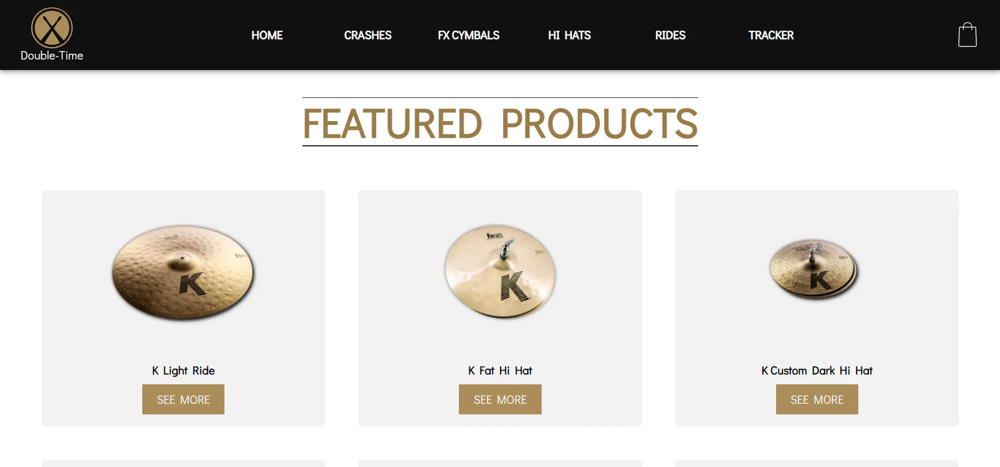
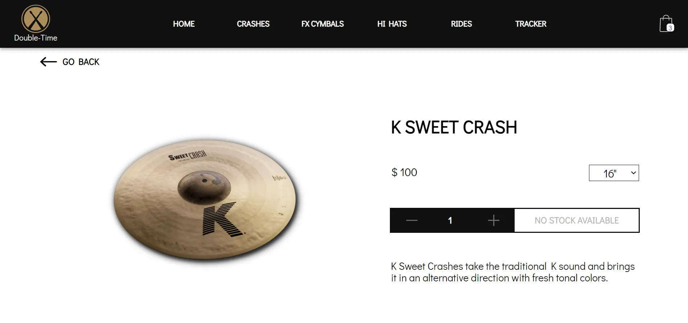
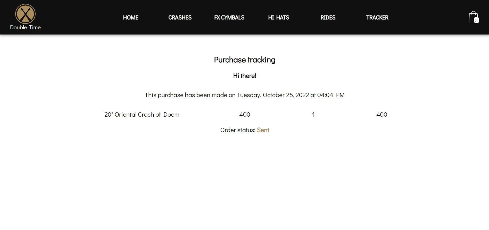

# Double-Time Drum Shop
Double-Time Drum Shop es una tienda ficticia de artículos para bateristas cuyo sitio web se desarrolla en este repositorio.
La idea tras el proyecto es desarrollar un e-commerce con un formato SPA (single page application) empleando React como herramienta principal.
Este trabajo es parte del proyecto final del curso de React JS de Coderhouse.

## Enlace al sitio activo
- https://doubletime-ds.netlify.app/

## Screenshots







## Tecnologías empleadas 
- HTML
- CSS 
- SASS
- React JS
- Otras librerías:
  - Toastify (notificaciones, https://fkhadra.github.io/react-toastify/introduction/)
  - React Router (navegación, https://reactrouter.com/)
  - UI Ball (loades, https://uiball.com/loaders)

## Funcionalidades
- Navegación SPA
- Carrito de compras que redirecciona a formulario de confirmación
- Filtrado por categorías
- Tracker de compras
- Actualización y verificación de stock

## Roadmap
- Modificar estilos para dar cualidad responsive al sitio (actualmente NO lo es)

## Estado del proyecto
Finalizado, con detalles pendientes que no afectan funcionalidades.

## Instalación
Clonado del repositorio de manera local
```bash
  git clone https://github.com/sfonzo96/reactjs-coderhouse.git
```
Moverse a repositorio local
```bash
  cd reactjs-coderhous
```
Instalación de paquetes y dependencias con npm
```bash
  npm install
```
Inicializar aplicación
```bash
  npm start
```
Detener servidor
```bash
  ctrl + c
```
## Authors
- [Santiago Fonzo](https://www.linkedin.com/in/santiagofonzo/)

## Licencia

Este proyecto está licenciado bajo la [Licencia MIT](LICENSE).
