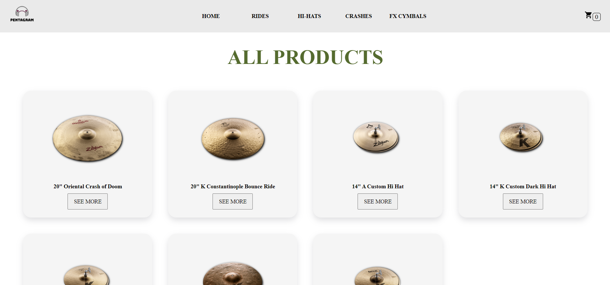
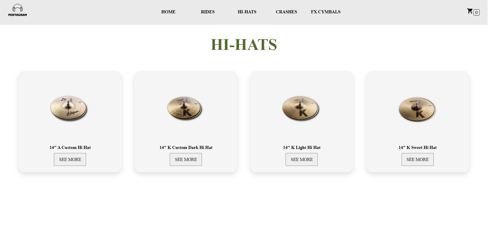
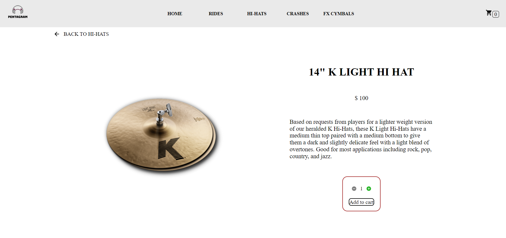

# Pentagram Drum Shop
Pentragram Drum Shop es una tienda ficticia de artículos para bateristas cuyo sitio web se desarrolla en este repositorio.
La idea tras el proyecto es desarrollar un e-commerce con un formato SPA (single page application) empleando React como herramienta principal.
Este trabajo es parte del proyecto final del curso de React JS de Coderhouse.

## Enlace al sitio activo
- Agrgar link una ves que se haya hecho un deploy
## Índice (Opcional por si queda largo al terminar proyecto)

- Hacer lista de links relativos

## Screenshots






## Tecnologías empleadas 
- HTML
- CSS 
- SASS
- React JS
- Otras librerías:
  - SweetAlert 2
  - React Router


## Instalación
Clonado del repositorio de manera local
```bash
  git clone https://github.com/sfonzo96/reactjs-coderhouse.git
```
Moverse a repositorio local
```bash
  cd reactjs-coderhous
```
Instalación de paquetes y dependencias con npm
```bash
  npm install
```
Inicializar aplicación
```bash
  npm start
```
Detener servidor
```bash
  ctrl + c
```

## Funcionalidades
- Navegación SPA
- Carrito de compras (en desarrollo)
- Filtrado por categorías

## Roadmap
- Carrito completamente funcional
- Más categorías y productos
- Integración con Firebase 
- Modos claro/oscuro y responsiveness

## Feedback
Ante sugerencias o recomendaciones podés comunicarte conmigo mediante LinkedIn: https://www.linkedin.com/in/santiagofonzo/

## Estado del proyecto
El proyecto se encuentra aún en desarrollo.

## Authors

- [@sfonzo96](https://github.com/sfonzo96/)


